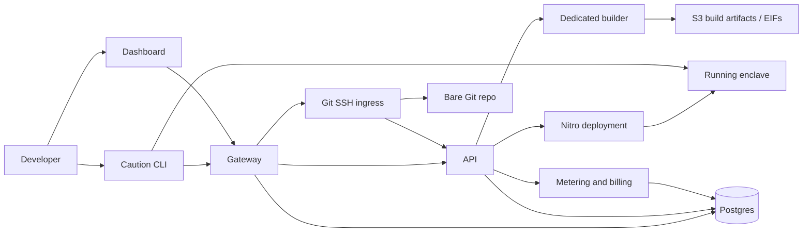
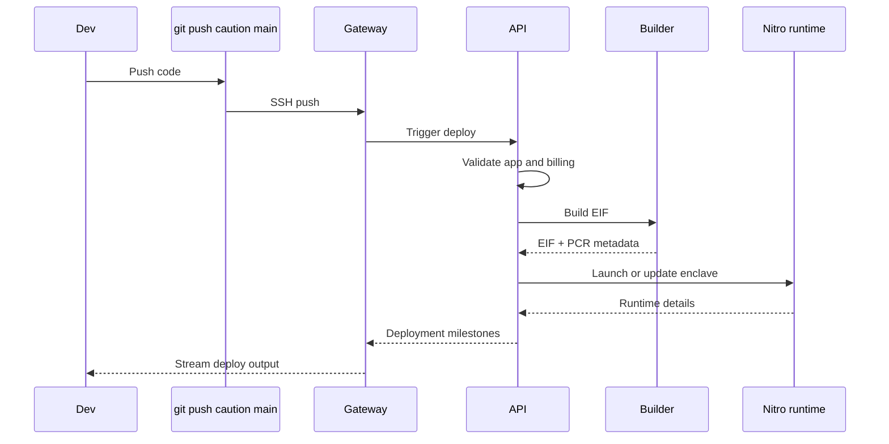
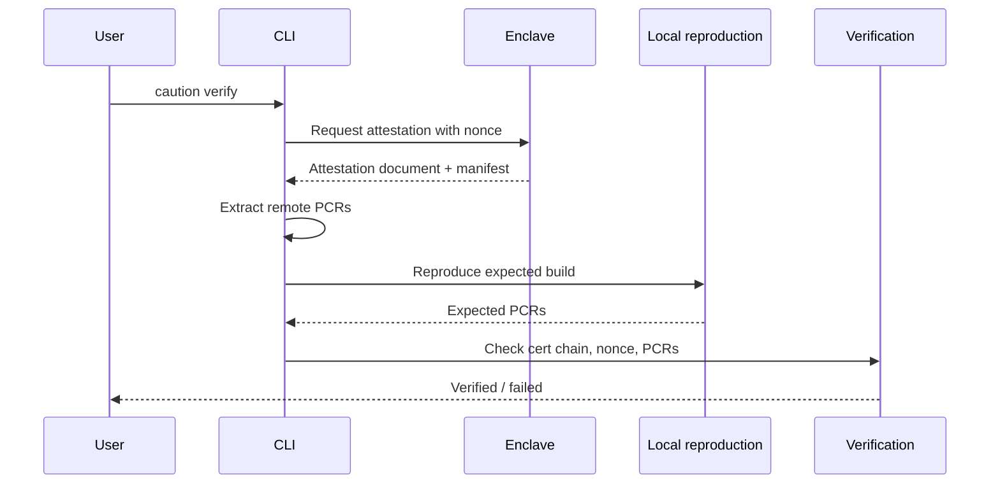

# How Caution works

Caution is a deployment and verification platform for AWS Nitro Enclaves.

At a high level, Caution helps you:

- authenticate with passkeys or security keys
- turn your application into a measured enclave image
- deploy that image either in Caution's cloud or your own AWS account
- verify that the running enclave matches the build you expect

The key idea is simple: Caution is not just a way to run enclaves. It is a way to deploy enclaves you can verify.

## High-Level Architecture

Caution is made up of a few core components that work together during authentication, deployment, and verification.



In practice:

- the Gateway handles authentication, sessions, SSH access, and Git push ingress
- the API manages apps, deploy orchestration, and runtime state
- the Builder turns source into an EIF and records the resulting measurements
- the Metering service handles credits, usage tracking, and billing
- the CLI is the main interface for setup, deployment, and verification

## How Deployment Works

Today, deployment is Git-based.

You initialize an app with the CLI, which creates or connects a Caution app, stores local deployment metadata, and configures a `caution` Git remote. Deployment happens when you push to that remote:

```bash
git push caution main
```

That push is received by Caution's gateway, which updates the app's Git repository and triggers the deployment workflow.



At a high level, the deploy path looks like this:

1. You push code to the `caution` Git remote.
2. The gateway accepts the push and updates the app's bare repository.
3. The API reads the pushed commit and deployment config.
4. A dedicated builder instance builds the EIF and captures PCR metadata.
5. The API deploys the resulting enclave image to the selected runtime.
6. Deployment progress is streamed back to your terminal.

## How Verification Works

After deployment, the running enclave exposes an attestation endpoint.

When you run `caution verify`, the CLI requests an attestation document from the enclave, extracts the remote PCRs, reproduces the expected PCRs locally, and checks that they match.



A successful verification means:

- the attestation chains back to AWS Nitro
- the attestation signature is valid
- the nonce matches the verifier's challenge
- the enclave's PCRs match the expected build output

In other words, the code running in the enclave matches the build you intended to deploy.

## Deployment Modes

Caution supports two main deployment paths.

### Fully managed

In fully managed mode, Caution runs the enclave in Caution-managed AWS infrastructure.

Use this when you want the simplest path to deployment and do not need the runtime to live inside your own cloud account.

### Bring your own cloud

In bring your own cloud mode, Caution manages the enclave lifecycle, but the runtime lives in your AWS account.

Use this when you want enclave workloads to run in your own AWS environment while still using Caution's deployment and verification workflow.

## What Each Component Does

### Gateway

The gateway handles:

- WebAuthn registration and login
- session cookies and CSRF protection
- SSH key management
- Git SSH ingress
- forwarding deployment output back to the user during `git push`

### API

The API handles:

- app and resource lifecycle
- deploy orchestration
- cloud credential handling
- deployment state
- deploy-time billing checks

### Builder

The builder is responsible for:

- turning application source into an EIF
- producing the PCR values associated with that build
- storing build artifacts in S3
- enabling reproducible verification later

### Metering

The metering service handles:

- usage tracking
- credit deduction
- billing state
- subscription and wallet-related calculations

### CLI

The CLI is the developer-facing entry point for:

- account setup
- app initialization
- Git remote setup
- verification
- bring-your-own-cloud setup flows

## A Good Mental Model

A useful way to think about Caution is:

- Git is the deployment trigger
- the build pipeline turns source into a measured enclave image
- the control plane launches that image into Nitro
- the CLI verifies that the running enclave matches the expected build

That is what makes Caution more than a deployment tool. It is a deploy-and-verify workflow for Nitro Enclaves.
