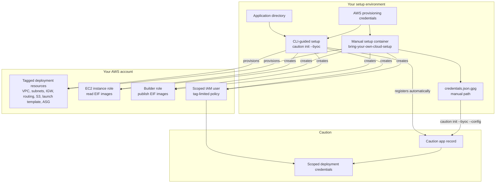

# Deploy in your own AWS account

Deploy Caution enclaves in your own AWS infrastructure while Caution handles the standard Docker build and deployment orchestration.
{: .docs-home-intro }

## What is bring your own compute?

Bring your own compute (BYOC) lets you run confidential enclaves in your own AWS account. A one-time setup script creates isolated AWS infrastructure and a scoped IAM identity that can only interact with resources tagged for Caution, then Caution manages deployments within that environment. For full details, see the [bring your own compute reference](../reference/byoc.md).

!!! info "AWS Nitro support today"
    Caution currently supports deployments on AWS Nitro Enclaves. We are actively working on support for Intel TDX, AMD SEV-SNP, and TPM 2.0 attestations.

## What you need

Before you begin, ensure you have the following:

<div class="quickstart-needs-table" markdown>

| What you'll need | Details |
|------------------|---------|
| Access code | Request access at [info@caution.co](mailto:info@caution.co) |
| Passkey | Browser or platform passkey, password manager passkey, or security key or smart card (YubiKey, NitroKey, or LibremKey) |
| CLI | Supported today on Linux (x86_64) or macOS (arm64) ([install](https://codeberg.org/caution/platform/src/branch/main/src/cli/README.md){:target="_blank"}) |
| Git | For cloning and pushing repositories ([install](https://git-scm.com/){:target="_blank"}) |
| Docker | With [containerd image store enabled](https://docs.docker.com/engine/storage/containerd/){:target="_blank"} ([install](https://www.docker.com/){:target="_blank"}) |
| Containerized app | Your application must be [containerized](../guides/containerize-an-application.md) |
| AWS credentials | For the AWS account where Caution will provision tagged resources |

</div>

AWS credentials should use a least-privilege IAM role when possible. Admin credentials can be used as an alternative. See [bring-your-own-cloud-setup](https://codeberg.org/caution/bring-your-own-cloud-setup) for guidance.

## Install the CLI

Clone the platform repository and run the automatic installer:

```bash
git clone https://codeberg.org/caution/platform
cd platform
make install-cli
```

On every supported platform (Linux/x86_64 and macOS/arm64) this builds the CLI
with your local host toolchain, after a one-time acknowledgement that the build
is not reproducibility-verified. To build the reproducible StageX CLI instead,
run `make install-cli-stagex` (Linux/x86_64 only). See the [CLI README](https://codeberg.org/caution/platform/src/branch/main/src/cli/README.md){:target="_blank"}
for explicit build targets and verification options.

## Create an account

To create an account, you'll need a valid access code and a passkey. You can register in the browser or with the CLI.

If you do not have an access code, request one at [info@caution.co](mailto:info@caution.co).

=== "CLI"

    ```bash
    caution register --alpha-code <your_code>
    ```

=== "Browser"

    1. Go to [dashboard.caution.co](https://dashboard.caution.co/){:target="_blank"}
    2. Enter your access code
    3. Use your passkey method
    4. Click **Continue**
    5. Approve Passkey interaction when prompted

## Add an SSH key

Add an SSH key so you can authenticate your Caution deployments:

=== "CLI"

    ```bash
    caution ssh-keys add --from-agent
    ```

=== "Browser"

    Add an SSH key from the [browser dashboard](https://dashboard.caution.co/){:target="_blank"}.

## Select an application

Deploy your own [containerized application](../guides/containerize-an-application.md), or start with one of the [Caution demo apps](https://codeberg.org/caution){:target="_blank"}. For this guide, use hello-world-enclave:

```bash
git clone https://codeberg.org/caution/demo-hello-world-enclave.git
cd demo-hello-world-enclave
```

For your own app, make sure the container builds from the repository root with the standard Docker form:

```bash
docker build -f Containerfile .
```

If you use another file, set `containerfile` in the `build` block and replace `Containerfile` with that path. Caution uses this build shape and does not pass extra build arguments, so public build-time values need to be part of the image inputs. Use [Locksmith](../concepts/key-services.md) for secrets.

## Set up your AWS environment

Choose how you want to provision the AWS environment for bring your own compute deployments. Both paths continue through the Caution CLI for app registration, Git-based deployment, and verification.

In both paths, setup uses your provisioning credentials to create tagged AWS resources and a scoped IAM user, then registers only the scoped deployment credentials with Caution:



### CLI-guided provisioning (recommended)

Use this path if you want Caution to provision AWS infrastructure and register deployment credentials automatically.

From your application directory, run:

```bash
caution init --byoc
```

This command detects your AWS credentials, provisions the required AWS infrastructure, creates your app on Caution, and registers the deployment credentials automatically.

#### Choose an AWS profile or account

A Caution user can have BYOC apps in different AWS accounts. Run setup from each app's directory with the credentials for that app's target account.

To select a named AWS profile, set `AWS_PROFILE` for the command and pass the target region explicitly:

```bash
AWS_PROFILE=production caution init --byoc --region us-east-1
```

The CLI reads static credentials (including an optional session token) for that profile from `~/.aws/credentials` and reads its default region from `~/.aws/config`. Profiles that depend on AWS IAM Identity Center (SSO), `credential_process`, or an assumed role are not resolved directly.

If the profile uses IAM Identity Center, authenticate it first:

```bash
aws sso login --profile production
```

Then use AWS CLI v2 to [resolve and export the profile's credentials](https://docs.aws.amazon.com/cli/latest/reference/configure/export-credentials.html){:target="_blank"} through the standard AWS environment variables:

```bash
eval "$(aws configure export-credentials --profile production --format env)"
export AWS_REGION=us-east-1
aws sts get-caller-identity
caution init --byoc
```

Temporary credentials expire. Resolve and export them again before setup or teardown if the session has expired.

`AWS_ACCESS_KEY_ID` and `AWS_SECRET_ACCESS_KEY` take precedence over `AWS_PROFILE`. Unset the credential environment variables before selecting a named static profile if they point to a different account:

```bash
unset AWS_ACCESS_KEY_ID AWS_SECRET_ACCESS_KEY AWS_SESSION_TOKEN
```

If the AWS CLI is installed, confirm the identity that the setup will use before provisioning:

```bash
AWS_PROFILE=production aws sts get-caller-identity
```

When you later run `caution teardown --byoc`, use the same provisioning identity: either the same named static profile or freshly exported temporary credentials for the original role or SSO session. Equivalent credentials must be in the same AWS account and have permission to delete every resource created by setup. An account match alone does not prove that the credentials can perform teardown.

Commit the generated `.caution/deployment.json` to your repository. The deployment file stores the Caution app resource ID so CLI commands can infer the target app from the repository.

### Manual provisioning

Use this path if you want more control over the AWS infrastructure setup before registering the deployment configuration with Caution.

From a working directory, run:

```bash
git clone https://codeberg.org/caution/bring-your-own-cloud-setup.git
cd bring-your-own-cloud-setup

cp .env.example .env
# Edit .env with your AWS credentials

docker build -t caution-provisioner-setup .

docker run --rm \
  --env-file .env \
  -v "$(pwd)/out:/out" \
  caution-provisioner-setup
```

This provisions the required AWS infrastructure and writes `credentials.json.gpg` to the `out/` directory.

!!! note "Use an existing VPC (Optional)"
    If you want Caution to provision resources in an existing VPC (Virtual Private Cloud) instead of creating a new one, set `VPC_ID=vpc-xxxxxxxx` in your `.env` file before running the Docker command.

To use the generated encrypted credentials, return to your application directory and run:

```bash
caution init --byoc --config /path/to/credentials.json.gpg
```

Commit the generated `.caution/deployment.json` to your repository. The deployment file stores the Caution app resource ID so CLI commands can infer the target app from the repository.

## What the setup creates

The setup flow creates an isolated environment for running enclaves in your AWS account:

<div class="byoc-setup-creates-table" markdown>

| Resource | Purpose |
|----------|---------|
| **VPC** | Dedicated `/16` VPC with public subnets across multiple availability zones, internet gateway, and routing |
| **S3 Bucket** | Stores enclave image files (EIFs). Named `caution-<deployment-id>-images`; one is created for each BYOC app setup |
| **EC2 Instance Role** | Allows enclave instances to read EIFs from the S3 bucket |
| **Builder Role** | Allows builder instances to publish EIF objects into the S3 bucket |
| **Launch Template** | Preconfigured template for enclave instances |
| **Auto Scaling Group** | Manages enclave instances (starts at 0, Caution scales as needed) |
| **Scoped IAM User** | Credentials for Caution, scoped to only these resources |

</div>

Each normal `caution init --byoc` setup generates a new deployment ID and a dedicated bucket. Subsequent Git-push deployments of that app reuse its bucket; the bucket is not shared with other BYOC apps in the same Caution user or AWS account. A successful `caution teardown --byoc` empties and deletes the bucket along with the app's other BYOC resources.

## Add environment variables

If your application needs environment variables, use [Key services](../concepts/key-services.md) before deploying. The guide covers non-encrypted variables for public configuration and encrypted variables for secrets, including how to deploy Keymaker, generate shard-holder OpenPGP keys, create a quorum bundle, encrypt values from `.env`, and reference secrets with `env::vault` in your `caution.hcl`.

Skip this step if your application does not need environment variables.

## Deploy the application

From your application directory, push the code to Caution:

```bash
git push caution main
```

Caution builds a reproducible enclave image with the standard Docker build and deploys it into the AWS environment you provisioned.

Deployment output includes a stable Caution-managed `DNS target`. If you
configured a custom domain in `caution.hcl`, create a CNAME from that subdomain
to the DNS target rather than an A record to the Elastic IP in your AWS account.
See [Set up a custom domain](../guides/set-up-a-custom-domain.md).

## Verify the deployment

From your application directory, reproduce the image and verify that the running enclave matches its expected PCRs:

```bash
caution verify
```

Successful verification saves the verified PCR values to `.caution/trusted_hashes.json`. This file is required before sending locksmith shards and can be used by native STEVE clients — commit it alongside your other `.caution/` files.

## Cleanup

!!! warning "Use provisioning credentials and verify cleanup"
    Teardown requires the same provisioning identity used during setup, or equivalent credentials in the same AWS account with permission to delete the provisioned resources. Confirm the selected identity immediately before teardown.

    The CLI destroys the Caution app before attempting AWS cleanup. If AWS
    cleanup then fails, it retains `.caution/deployment.json` and
    `~/.caution/<app>/bring-your-own-compute.json` so you can retry with the
    correct credentials. The app deletion has already completed, so keep that
    local state until AWS teardown succeeds or you finish manual cleanup.

With a named static profile, confirm the identity and select that profile for teardown:

```bash
AWS_PROFILE=production aws sts get-caller-identity
AWS_PROFILE=production caution teardown --byoc
```

If setup used temporary role or SSO credentials, resolve and export them again using the earlier AWS CLI v2 flow, confirm them with `aws sts get-caller-identity`, then run `caution teardown --byoc`.

Run teardown from your application directory (or ensure local BYOC state exists in `~/.caution/<app>/bring-your-own-compute.json`). Deployments created by older CLI versions may use the legacy `bring-your-own-cloud.json` filename, which the current CLI also recognizes.

If you need manual cleanup details, see the cleanup instructions in the [BYOC repo](https://codeberg.org/caution/bring-your-own-cloud-setup){:target="_blank"}.

## Next steps

Your application is now running in a verified enclave in your own AWS account. Here's what to explore next:

<div class="grid cards" markdown>

- :lucide-server: **Bring your own compute**

    ---

    Run Caution enclaves in [your own AWS account](../reference/byoc.md).

- :lucide-rocket: **Deployment configuration**

    ---

    Configure [source verification and networking](../reference/deployment-configuration.md) options.

- :lucide-file-code: **caution.hcl**

    ---

    Configure how your application [runs and verifies](../reference/caution-hcl.md).

- :lucide-shield-check: **Verifiability**

    ---

    Learn how Caution [ensures code integrity](../concepts/verifiability.md) from source to production.

</div>
