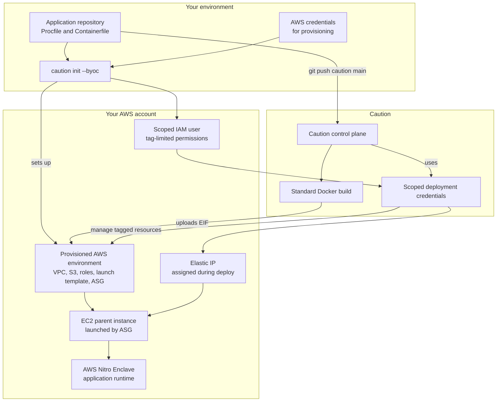

# Bring your own cloud

<p class="docs-home-intro">Learn how bring your own cloud works, what stays in your AWS account, and what Caution manages within that boundary.</p>

## Overview

Bring your own cloud (BYOC) lets you run confidential enclaves in your own AWS account. A one-time setup script creates isolated AWS infrastructure and a scoped IAM identity limited to resources tagged for Caution, then Caution manages deployments within that environment.

It is best for teams that:

- [x] Need workloads and data to stay in their own AWS account
- [x] Need control over AWS billing and account boundaries
- [x] Want Caution to manage enclave operations within their environment

For a side-by-side comparison with other deployment options, see [deployment models](deployment-models/).

## Responsibility split

In bring your own cloud, Caution runs the standard Docker application build and manages the enclave lifecycle in your AWS account, while you retain control over the account, network boundaries, and where data resides.

<div class="two-column-list two-column-list--byoc-responsibility" markdown>
<div markdown>

**You control:**

- Your AWS account and billing
- Network configuration and VPC
- Where your data resides

</div>
<div markdown>

**Caution handles:**

- Standard Docker application builds
- Enclave lifecycle management
- Deployment orchestration in your AWS account, including uploading EIFs to your S3 bucket, launch templates, and Elastic IP assignment

</div>
</div>

## How it works

To deploy with bring your own cloud, you'll need a [containerized application](../guides/containerize-an-application.md), Docker, and AWS credentials for the target account. Caution builds from the repository root with `docker build -f <containerfile> .`; it does not run a custom `build` command or pass extra Docker build arguments. Public build-time values must be part of the image inputs, and secrets should use [Locksmith](../concepts/key-services.md).

The deployment boundary looks like this:



Once you have everything in place, the setup flow looks like this:

1. Provide AWS credentials and run the setup flow from your application directory.
2. Caution provisions an isolated environment in your AWS account and registers scoped credentials for the deployment.
3. Deploy your application and let Caution manage the enclave lifecycle within that environment.

!!! example "Setup guide"
    For the full step-by-step setup and deployment flow, see the [bring your own cloud guide](../quickstart/bring-your-own-cloud.md).

## Security model

### Tag-based resource scoping

All resources are tagged with:

```text
caution:deployment-id = <deployment-id>
```

The IAM policy uses AWS condition keys to enforce scope:

- `aws:ResourceTag/caution:deployment-id` - For existing resources
- `aws:RequestTag/caution:deployment-id` - For new resources

### What the scoped credentials CAN do

- Read/write EIF images to the deployment's S3 bucket
- Start/stop/terminate EC2 instances with the deployment tag
- Create new instances via the ASG (automatically tagged)
- Manage volumes, security groups, and EIPs with the deployment tag
- Scale the specific Auto Scaling Group
- Create and manage launch template versions

### What the scoped credentials CANNOT do

- Access any resources without the deployment tag
- Access other S3 buckets
- Modify other Auto Scaling Groups or launch templates
- Access resources in other deployments
- Escalate privileges or modify IAM policies
- Access network resources outside the deployment VPC

## Instance types

Caution automatically selects an appropriate Nitro Enclave-compatible instance based on your CPU and memory requirements:

| Instance | vCPUs | Memory | Enclave capacity |
|----------|-------|--------|------------------|
| `m5.xlarge` | 4 | 16 GB | Up to 2 CPUs, 14 GB |
| `m5.2xlarge` | 8 | 32 GB | Up to 6 CPUs, 30 GB |
| `m5.4xlarge` | 16 | 64 GB | Up to 14 CPUs, 62 GB |
| `m5.8xlarge` | 32 | 128 GB | Up to 30 CPUs, 126 GB |

The host instance reserves ~2 vCPUs and ~2 GB memory for the parent instance.

## Maintenance

These tasks apply to existing bring your own cloud deployments after provisioning, for example when you need to refresh IAM permissions or remove the AWS resources created during setup.

### Updating IAM policy

To update the IAM policy for an existing deployment (for example, after script improvements), set `DEPLOYMENT_ID` and `VPC_ID` in your `.env` file, then run:
```bash
docker run --rm \
  --env-file .env \
  caution-provisioner-setup python setup.py --update-policy
```

### Cleanup

To remove all resources created by the setup, see the cleanup instructions in the [BYOC repo](https://codeberg.org/caution/bring-your-own-cloud-setup){:target="_blank"}.

## See also

<div class="grid cards" markdown>

- :lucide-box: **Containerize an application**

    ---

    Follow a [practical guide](../guides/containerize-an-application.md) to building reproducible containers with StageX.

- :lucide-file-code: **Procfile**

    ---

    Configure how your application [runs and verifies](procfile.md).

- :lucide-globe: **Set up a custom domain**

    ---

    Use your own [domain name](../guides/set-up-a-custom-domain.md) for deployments.

- :lucide-rocket: **Deployment configuration**

    ---

    Configure [source verification and networking](deployment-configuration.md) options.

</div>
