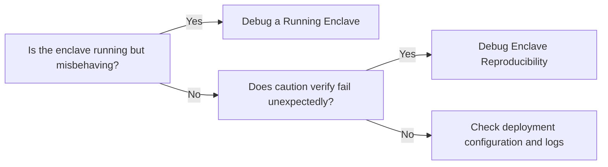

# Debug an enclave

Diagnose and fix issues with your enclave deployments, or verify that your builds are reproducible end-to-end.

## At a glance

Debug an enclave includes two areas of troubleshooting, depending on whether you need runtime access to a running enclave or want to verify that your enclave image can be reproduced from source.

| Guide | Use when |
|-------|----------|
| [Debug a Running Enclave](running.md) | You need SSH access to the host, console output, or network diagnostics for a deployed enclave. |
| [Debug Enclave Reproducibility](reproducibility.md) | You need to verify that the same source produces the same EIF and PCR values. |

## Debug a Running Enclave

If your enclave is deployed but unreachable, you need console output, or you want to inspect host-side services, start with the [running enclave guide](running.md). It covers enabling debug mode, SSH access, inspecting Nitro services, and reading console output.

## Debug Enclave Reproducibility

If you are debugging why a `caution verify` check fails, comparing PCR values across builds, or confirming that source changes produce the expected measurement differences, see the [reproducibility guide](reproducibility.md). It covers the build pipeline, PCR computation, and local QEMU testing.

## Which should you choose?

