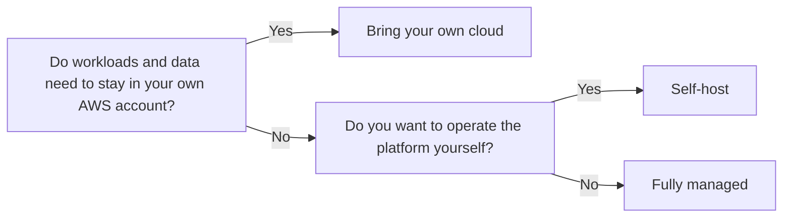

# Deployment models

Caution supports multiple deployment models depending on how much infrastructure ownership and operational control you want.

Use [fully managed](../fully-managed.md) for the fastest path to production, [bring your own cloud](../bring-your-own-cloud.md) to run in your own AWS account, or self-host if you want to operate the platform yourself.

!!! info "Current platform support"
    Caution currently supports deployments on AWS Nitro Enclaves. We are actively working on support for Intel TDX, AMD SEV-SNP, and TPM 2.0 attestations.

## At a glance

Teams choose fully managed for the fastest setup and simplest operational path. They choose bring your own cloud (BYOC) when workloads and data must stay in their own AWS account.

| Model | Hosted in | Caution manages | You manage |
|-------|-----------|-----------------|------------|
| **Fully managed** | Caution-managed infrastructure | Infrastructure, enclave lifecycle, and public ingress | Application code and deployment configuration |
| **Bring your own cloud** | Your AWS account | Builds, enclave lifecycle, and deployment orchestration in your AWS account | AWS account, billing, network boundaries, and data residency |
| **Self-host** | Your own environment | Nothing | Platform operations, infrastructure, and deployments |

## Fully managed

Fully managed is for teams that want Caution to host and operate deployments end to end. Your application runs on Caution-managed infrastructure, while you keep control of your code and deployment configuration.

- Start here if you want the fastest path to production.
- Use the [fully managed quickstart](../../quickstart/fully-managed.md) to deploy your first app.
- See the [fully managed reference](../fully-managed.md) for responsibilities, requirements, and fit.

## Bring your own cloud

Bring your own cloud is for teams that want Caution to manage verifiable deployments in their own AWS account. Your data and workloads stay in your environment while Caution manages the enclave lifecycle within that boundary.

- Start here if you need your own AWS account, billing boundary, or network controls.
- Use the [bring your own cloud quickstart](../../quickstart/bring-your-own-cloud.md) to set up and deploy.
- See the [bring your own cloud reference](../bring-your-own-cloud.md) for the operating model, security model, and maintenance details.

## Self-host

Caution is fully open source, and you can self-host the platform if you want to operate deployments independently instead of using a Caution-managed path.

- Start here if you need full platform control or want to run the system yourself.
- Self-hosting is not part of the guided quickstart flow today.
- See the [Caution source code on Codeberg](https://codeberg.org/caution){:target="_blank"} to explore the platform.

## Which should you choose?

Use this decision flow if you want the shortest path to a recommendation:

### Choose fully managed if:

- You want to get started quickly without infrastructure setup
- You do not have specific data residency requirements
- You prefer Caution to handle operational concerns

### Choose bring your own cloud if:

- You want data and workloads to stay in your own AWS account
- You need control over AWS billing and account boundaries
- You want Caution to manage enclave operations without hosting the deployment environment
- You have network or compliance requirements tied to customer-owned infrastructure

### Choose self-host if:

- You want to operate the platform independently
- You want to manage your own infrastructure and platform operations
- You do not need a guided Caution-managed setup path
