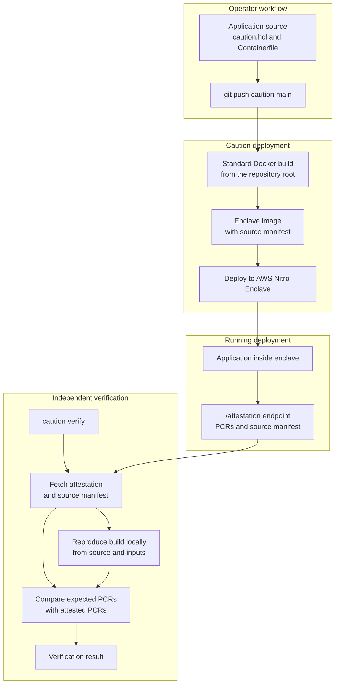

# What is Caution?

Understand what Caution is, why it exists, and how it changes the trust model for sensitive workloads.

## What Caution is

Caution is a general-purpose, [verifiable](concepts/verifiability.md) confidential compute platform for deploying sensitive applications in secure enclaves. It connects running enclave measurements back to the intended source code and build inputs that produced the enclave image. It currently supports deployments on AWS Nitro Enclaves, with additional attestation backends in active development.

It combines enclave isolation, [hardware attestation](concepts/attestation.md), [reproducible builds](concepts/reproducibility.md), and support for [end-to-end encryption](concepts/encryption.md). Together, these let users verify code integrity and keep requests protected by an active, correctly configured STEVE v2 client encrypted all the way into the enclave.

In both fully managed and bring your own compute deployments, Caution connects the operator's deployment workflow to an independent verification workflow:

## Why it exists

Caution exists to move sensitive cloud services from "trust us" to "verify it yourself." It helps operators reduce blind trust by giving customers, auditors, and downstream services independent evidence of what is running. That matters when sensitive data, secrets, or automated decisions depend on software running outside the verifier's control.

## The problem it solves

Cloud applications often require users to trust infrastructure operators, deployment pipelines, cloud providers, and private build systems. Confidential compute improves this by isolating workloads from the host and using hardware attestation to report enclave measurements.

That is an important baseline, but it does not answer what code is running inside the enclave. An operator or compromised deployment pipeline could run code that differs from the intended source code inside a genuine enclave, and isolation alone would provide no way to detect it.

Caution makes confidential compute verifiable by connecting enclave measurements back to the intended source code and build inputs that produced the enclave image.

It gives organizations, customers, auditors, and downstream services integrity guarantees that connect the intended source code, build inputs, and configuration to what is actually running inside an enclave. It also simplifies enclave deployments by integrating deployment and verification into familiar Git-based and CLI workflows.

| Problem | How Caution solves it |
|---------|------------------------|
| Attestation alone does not prove that a running enclave matches the intended source and build process. | Caution connects enclave measurements back to [intended source code, build inputs, and configuration](concepts/verifiability.md). |
| Verifiers need a practical way to check a running enclave themselves. | Verification with [`caution verify`](guides/verify-an-app.md) validates the attestation, reproduces expected measurements from source, and compares them with the running enclave. |
| Enclave deployments often require custom infrastructure and specialized security expertise. | Caution's [Git-based and CLI workflows](quickstart/) handle deployment, attestation, and verification, making confidential compute easier to adopt. |
| Teams need different levels of infrastructure control. | Caution supports [fully managed](reference/fully-managed.md), [bring your own compute](reference/byoc.md), and self-hosted deployment models. |
| Most enclave deployments depend on a single hardware root of trust. | Caution supports AWS Nitro Enclaves today and has [multi-hardware attestation](concepts/attestation.md#multi-hardware-attestation) support on the 2026 roadmap. |

## Who it is for

Caution is for teams building services where ordinary cloud trust is not enough. As a general-purpose platform, Caution is not tied to one industry or application type; any workload that benefits from independently verifiable code integrity and enclave-protected data can use the model.

Example workloads that benefit from source-to-enclave verification include AI inference, oracles and data feeds, key management and signing systems, and nodes or staking infrastructure.

Caution is a fit when:

- Your customers or downstream services need to verify the software they interact with
- You want customers to depend less on infrastructure administrators
- You need to reduce insider risk from operators or compromised deployment pipelines
- You need stronger guarantees for code integrity, data confidentiality, or secret delivery
- You need deployment options that match your infrastructure, data residency, or control requirements

## What makes it different

Most confidential compute systems can prove that a workload is running in a protected environment and that the deployed image has not changed since launch.

Caution is designed to turn confidential compute into verifiable compute by adding a source-to-enclave chain of evidence:

| Capability | Confidential compute | Verifiable compute |
|------------|----------------------|---------------------------------|
| Workload isolation from the host | :lucide-circle-check:{ .caution-icon-yes } | :lucide-circle-check:{ .caution-icon-yes } |
| Hardware attestation | :lucide-circle-check:{ .caution-icon-yes } | :lucide-circle-check:{ .caution-icon-yes } |
| Enclave measurements | :lucide-circle-check:{ .caution-icon-yes } | :lucide-circle-check:{ .caution-icon-yes } |
| Source-to-enclave evidence | :lucide-circle-x:{ .caution-icon-no } | :lucide-circle-check:{ .caution-icon-yes } |
| Reproducible verification from source and build inputs | :lucide-circle-x:{ .caution-icon-no } | :lucide-circle-check:{ .caution-icon-yes } |
| Independent source-linked verification | Binary-level attestation&nbsp;only | :lucide-circle-check:{ .caution-icon-yes } |

This lets verifiers evaluate the source and build process behind a running enclave, not only the binary measurements reported by hardware attestation.

Caution is [fully open source](https://codeberg.org/caution){:target="_blank"}, so teams can inspect the platform, understand the verification path, and self-host it if they want to operate deployments independently.

Caution turns verification into a developer workflow. Teams deploy with familiar Git-based workflows, expose attestation endpoints, and let verifiers reproduce enclave images locally.

## Security model

Caution's security model is designed to reduce trust in operators, infrastructure, and deployment pipelines by combining four capabilities:

- **Isolation**: Workloads run inside confidential compute enclaves isolated from the host environment.
- **[Verifiability](concepts/verifiability.md)**: `caution verify` checks that the running enclave matches the expected source and build inputs.
- **[Reproducibility](concepts/reproducibility.md)**: Deterministic, source-bootstrapped tooling lets enclave images be rebuilt and compared from the application down to the kernel.
- **[End-to-end encryption](concepts/encryption.md)**: Requests protected by an active, correctly configured STEVE v2 client remain encrypted all the way into the enclave, so infrastructure operators do not see their plaintext.

These capabilities are strongest when the application source is available, the build is reproducible, the app runs outside debug mode, and sensitive requests use an active, correctly configured STEVE v2 client.

This security model is grounded in the [Distrust Threat Model](https://distrust.co/threatmodel.html){:target="_blank"}, an adversary framework designed by the same team behind Distrust and Caution. The threat model assumes systems may already be compromised at some level. Caution applies that assumption by reducing reliance on operators, infrastructure, and deployment pipelines.

## What Caution does not prove

Caution does not determine whether source code is safe, bug-free, or appropriate for a given use case. Verification proves that the running enclave matches the intended source code and build inputs. Users and auditors still need to inspect the code and decide whether they trust what it does.

## Next steps

- :lucide-zap: **Get started**

    ---

    Deploy your first verifiable enclave with the [quickstart](quickstart/).

- :lucide-layers-3: **Deployment models**

    ---

    Compare [fully managed, bring your own compute, and self-hosted](reference/deployment-models/) options.

